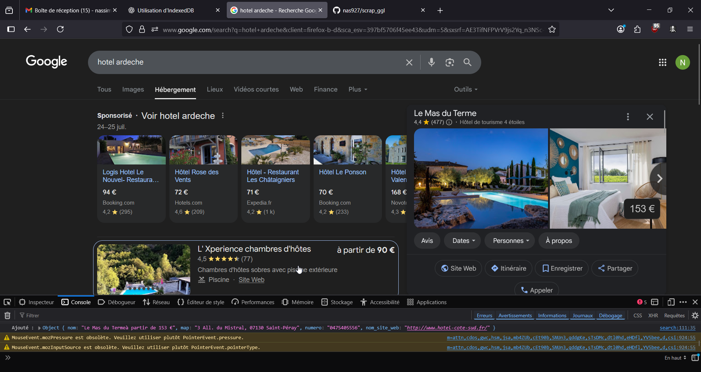
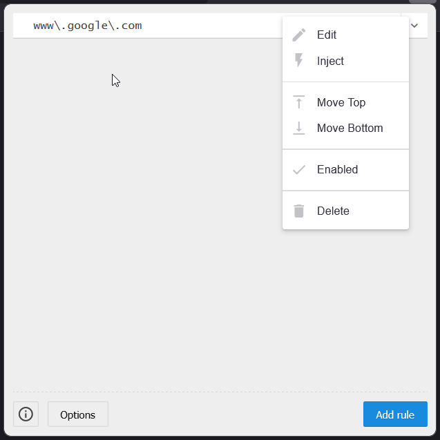

# How to use it

Use firefox to be sure everything is same
go on google
search hostel, restaurant anything that google will map look at the pic below

[download](https://github.com/Lor-Saba/Code-Injector)
Open the extension
Add rule
Select current host
Paste the code from google.js to js in the extension
Save

Check enable and click on inject
Enjoy your scraping.

